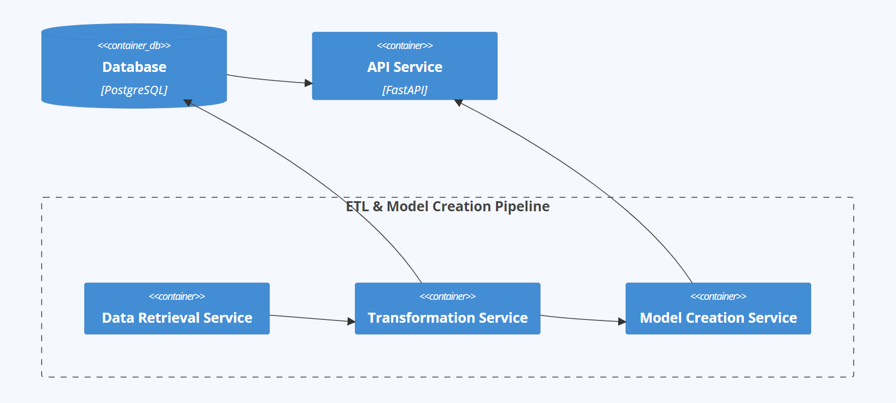

# Datasientest Project: feb24_project_job-market

## Project description
The application was developed for job posters and job seekers to rectify a common problem encountered during job posting: an improved way of making estimates on salaries with a better degree of accuracy. The development of the application was foccused mainly on the ETL process that is relevant for Data Engineering experience. The application also leverages a Machine Learning (ML) model to give end-users an estimate of their probable salaries, leading towards better, more informative career choices. We provided a simple yet effficient API interface to access the trained model and we zoomed specifically on Data-related job postings.
## Install Instructions
### Linux and MacOs
Run the setup script from the project´s root folder:
```bash
bash setup_jobmarket.sh
``` 
Alternatively:
```bash
chmod +x  setup_jobmarket.sh
./setup_jobmarket.sh
```
The script may require superuser rights to add a cronjob. If prompted, run the script with sudo:
```bash
sudo bash setup_jobmarket.sh
``` 
After running the script, you can verify the installation with pytest. Ensure you're using the correct pytest version by creating a virtual environment and installing dependencies from the `requirements.txt` file:
```bash
python -m venv .venv
source .venv/bin/activate 
pip install -r requirements.txt
``` 
### Windows
You can use the PowerShell script to install from the project's root folder. Note that no cronjob will be installed, and automatic updates of collected job information won't occur. Windows support is primarily for testing and development:
```powershell
.\setup_jobmarket.ps1
```
## System Architecture
The project is divied in five mircoservices:
- postgres databse server (prebuild image from dockerhub)
- pipeline for ETL and model creation:
  - data retrieaval service for collecting the raw data
  - transforamtion service which transforms the raw data and saves them in a postgres database
  - model creation service that uses the transformed data to create models for the salaray prediction
- api server that uses the crreated models and the transformed data to deliver a salaray prediction

## Data Flow


## Data Model


## Manual building the docker images
This section is for building and testing individual docker images/containers.<br>
To build them all in one step use the `docker-compose` command, see install instructions.<br>
For using the following commands you have to be in the project root folder.<br>
Create the required folder structure with:<br>
```bash
mkdir -p ./data/logs/
mkdir -p ./data/raw/
mkdir -p ./data/processed/
mkdir -p ./data/model/
```
### Setting up the database and network
Create the network (it´s briged by default)<br>
`docker network create jobmarket_net`<br>
<br>
Create the database:<br>
```bash
docker run --rm -d -p 5432:5432 
-e POSTGRES_PASSWORD=feb24 
--network jobmarket_net 
--name jobmarket_db  
-v ${PWD}/data/postgres:/var/lib/postgresql/data 
-v ${PWD}/src/postgres:/docker-entrypoint-initdb.d
postgres
``` 
This command uses the `create_databse.sql` script of the `./src/postgres` folder to create the database during its first start.
<br>
### Build the data_retrieval app

`docker build -t data_retrieval_app -f ./src/data_retrieval/Dockerfile .`<br>
Create a container to check if it works:<br>
`docker run --rm -it data_retrieval_app bash`<br>
### Test the data retireval app
Start the transformation app with the required configuration.<br>
```bash
docker run --rm -it 
-e PATH_DATA_RAW="/data_retrieval_app/data/raw" 
-e PATH_DATA_PROCESSED="/data_retrieval_app/data/processed" 
-e DIR_NAME_MUSE="muse.com" 
-e DIR_NAME_REED="reed.co.uk" 
-e KNOWN_CURRENCY="['$', '£', '€']" 
-e DIR_NAME_OKJOB="okjob.io" 
-e OKJOB_API_KEY="<API Key>" 
-e REED_API_KEY="<API Key>" 
-e API_VERSION_REED="1.0" 
-e LOGFILE=data/data_retrieval.log 
-v ${PWD}/data/:/data_retrieval_app/data/ 
--name jobmarket_data_retrieval data_retrieval_app
```
<br>
We can now use our data retrieval command:<br>

`python main.py -h`<br>

```
usage: main.py [-h] [-s START_INDEX] [-e END_INDEX] [-l SLEEP_TIME] {init,update}

Data retrieval tool that can perform initial data retrieval or an update ('init' or 'update')

positional arguments:
  {init,update}         data retrieval, can either do the initial data retrieval or and update ('init' or 'update')

optional arguments:
  -h, --help            show this help message and exit
  -s START_INDEX, --start START_INDEX
                        Start index for reed init
  -e END_INDEX, --end END_INDEX
                        End index for reed init
  -l SLEEP_TIME, --sleep SLEEP_TIME
                        Idle time for reed init
```

### Build the transform app
`docker build -t transform_app -f ./src/transform/Dockerfile .`<br>
<br>
Create a container and test it:<br>

`docker run --rm -it transform_app bash`<br>
<br>

### Test the transform app
Start the transformation app with the required configuration.<br>

```bash
docker run --rm -it 
-e PATH_DATA_PROCESSED="/transform_app/data/processed" 
-e DIR_NAME_MUSE="muse.com/merged" 
-e DIR_NAME_REED="reed.co.uk/merged" 
-e DIR_NAME_OKJOB="okjob.io/merged" 
-e POSTGRES_DBNAME="jobmarket" 
-e POSTGRES_USER="postgres" 
-e POSTGRES_PASSWORD="feb24" 
-e POSTGRES_HOST="jobmarket_db" 
-e POSTGRES_PORT=5432 
-e LOGFILE=data/transform.log 
-v ${PWD}/data/:/transform_app/data/ 
--network jobmarket_net
--name jobmarket_transform
transform_app bash
``` 
<br>

### Build the model app

`docker build -t model_app -f ./src/model_creation/Dockerfile .`<br>
<br>
Create a container and test it:<br>

`docker run --rm -it model_app bash`<br>
<br>

### Test the model app
Start the model app with the required configuration.<br>

```bash
docker run --rm -it 
-e PATH_MODEL="/model_app/data/model" 
-e POSTGRES_DBNAME="jobmarket" 
-e POSTGRES_USER="postgres" 
-e POSTGRES_PASSWORD="feb24" 
-e POSTGRES_HOST="jobmarket_db" 
-e POSTGRES_PORT=5432 
-e LOGFILE=data/model_creation.log 
-v ${PWD}/data/:/model_app/data/ 
--network jobmarket_net
--name jobmarket_model
model_app bash
``` 
### Build the api app
`build -t api_app -f ./src/api/Dockerfile .`<br>
Create a container and test it:<br>
`docker run --rm -it api_app bash`<br>
<br>

### Test the api app
Start the api app with the required configuration (use option `-d` if you don´t want to see the output):<br>

```bash
docker run --rm -it  -p 8000:8000 
-e PATH_MODEL="/api_app/data/model"  
-e POSTGRES_DBNAME="jobmarket"  
-e POSTGRES_USER="postgres"  
-e POSTGRES_PASSWORD="feb24"  
-e POSTGRES_HOST="jobmarket_db"  
-e POSTGRES_PORT=5432  
-e LOGFILE=data/api.log  
-e UVICORN_PORT=8000 
-v ${PWD}/data/:/api_app/data/  
--network jobmarket_net 
--name jobmarket_api api_app
``` 
<br>
You can now access the api via your browser and test the api:<br>
http://localhost:8000/docs <br>
<br>


