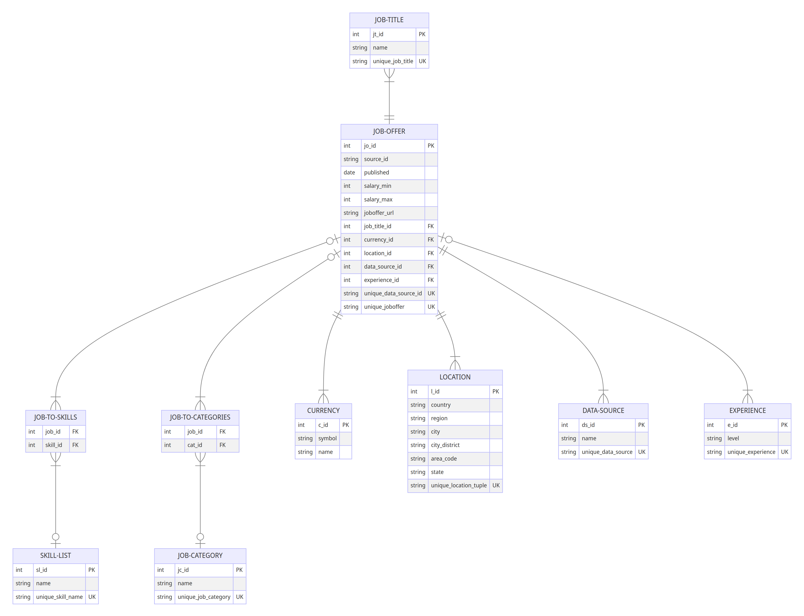

# Datasientest Project: Data Job Salary Predictor

## Project description
Our project, "Data Job Salary Predictor," addresses a common challenge encountered by both job posters and seekers: the need for more accurate salary estimates during job postings. By establishing lower and upper bounds for salary predictions specific to each job within a given country, our application aims to provide more precise salary estimates. To enhance prediction accuracy, we incorporate additional factors such as specific geographical location within the country, level of job experience, and relevant job skills.
<br>
<br>
**Data Related Job Focus**:
At the core of our application lies a specialized focus on data-related job postings. Recognizing the need for precise classification of job titles, we employ advanced techniques to categorize and generalize job titles within the data industry. This classification is crucial for generating accurate prediction models tailored to the unique demands of data-related roles.
<br>
The development of our application is centered around the Extract, Transform, Load (ETL) process, a fundamental aspect of Data Engineering. Through this process, we collect job offers from diverse data sources and standardize the data into a uniform format. Notably, we emphasize the standardization of salary data into yearly figures, enabling easier comparison across different job postings. Additionally, we extract essential job skills and experience requirements from job descriptions to enrich our dataset.
<br>
<br>
**Model Creation and Data Classification**:
During model creation, our focus on data-related job postings becomes even more pronounced. The necessity to accurately predict salaries within the data industry requires precise classification of job titles. By leveraging advanced machine learning techniques, we classify job titles into relevant data-related categories, ensuring that our prediction models are tailored to the specific requirements of the data job market.
<br>
Our data model is designed with scalability in mind, allowing for the seamless integration of new data sources. It accommodates future job data that may not be currently utilized but could enhance prediction accuracy, such as detailed location information and job categories.
<br>
Incorporating Machine Learning techniques, our application delivers estimated salary ranges to end-users, empowering them to make informed career decisions. We deploy two models—one for predicting minimum salaries and another for maximum salaries. Our user-friendly API interface grants easy access to these trained models, specifically focusing on data-related job postings. Through these efforts, we strive to provide a valuable tool for both job seekers and employers in the dynamic data job market.
### Data Sources
At the moment the application uses the following data sources:
- muse.com
- okjob.io
- reed.co.uk 
<br>
More data sources can be added in the future.
## Installtion Instructions
### Linux and MacOs
Run the setup script from the project´s root folder:
```bash
bash setup_jobmarket.sh
``` 
Alternatively:
```bash
chmod +x  setup_jobmarket.sh
./setup_jobmarket.sh
```
The script may require superuser rights to add a cronjob. If prompted, run the script with sudo:
```bash
sudo bash setup_jobmarket.sh
``` 
After running the script, you can verify the installation with pytest. Ensure you're using the correct pytest version by creating a virtual environment and installing dependencies from the `requirements.txt` file:
```bash
python -m venv .venv
source .venv/bin/activate 
pip install -r requirements.txt
``` 
### Windows
You can use the PowerShell script to install from the project's root folder. Note that no cronjob will be installed, and automatic updates of collected job information won't occur. Windows support is primarily for testing and development:
```powershell
.\setup_jobmarket.ps1
```
## System Architecture
The project is structured into five microservices, each encapsulated within a Docker container:

- PostgreSQL Database Server:
  Utilizes a prebuilt image from DockerHub to host the project's database.
- ETL and Model Creation Pipeline:
  - Data Retrieval Service:
    Responsible for gathering raw data from various sources.
  - Transformation Service:
    Transforms the raw data into a standardized format and stores it in a PostgreSQL database.
  - Model Creation Service:
    Utilizes the transformed data to develop predictive models for salary estimation.
- API Server:
  Utilizes the created models and transformed data to provide salary predictions to end-users.

This architecture ensures modularity and scalability, allowing for efficient management and deployment of each component. The microservices architecture also facilitates independent development and scaling of individual services as needed.

## Data Flow
The data retrieval service first extracts raw data from various sources and stores it in a local folder. Subsequently, the transformation server accesses this local folder, processes the raw data, standardizes it, and then saves the transformed data into a PostgreSQL database. Following this, the model creation service retrieves the transformed data from the database, utilizes it to generate predictive models, and then stores these models in a designated local folder. Finally, the API server leverages both the stored models from the local folder and the data from the database to provide salary predictions to end-users based on their input parameters.


## Data Model
The transformed data will be saved in a PostgreSQL database according to this schema:


## Manual building the docker images
This section is for building and testing individual docker images/containers.<br>
To build them all in one step use the `docker-compose` command, see install instructions.<br>
For using the following commands you have to be in the project root folder.<br>
Create the required folder structure with:<br>
```bash
mkdir -p ./data/logs/
mkdir -p ./data/raw/
mkdir -p ./data/processed/
mkdir -p ./data/model/
```
### Setting up the database and network
Create the network (it´s briged by default)<br>
`docker network create jobmarket_net`<br>
<br>
Create the database:<br>
```bash
docker run --rm -d -p 5432:5432 
-e POSTGRES_PASSWORD=feb24 
--network jobmarket_net 
--name jobmarket_db  
-v ${PWD}/data/postgres:/var/lib/postgresql/data 
-v ${PWD}/src/postgres:/docker-entrypoint-initdb.d
postgres
``` 
This command uses the `create_databse.sql` script of the `./src/postgres` folder to create the database during its first start.
<br>
### Build the data_retrieval app

`docker build -t data_retrieval_app -f ./src/data_retrieval/Dockerfile .`<br>
Create a container to check if it works:<br>
`docker run --rm -it data_retrieval_app bash`<br>
### Test the data retireval app
Start the transformation app with the required configuration.<br>
```bash
docker run --rm -it 
-e PATH_DATA_RAW="/data_retrieval_app/data/raw" 
-e PATH_DATA_PROCESSED="/data_retrieval_app/data/processed" 
-e DIR_NAME_MUSE="muse.com" 
-e DIR_NAME_REED="reed.co.uk" 
-e KNOWN_CURRENCY="['$', '£', '€']" 
-e DIR_NAME_OKJOB="okjob.io" 
-e OKJOB_API_KEY="<API Key>" 
-e REED_API_KEY="<API Key>" 
-e API_VERSION_REED="1.0" 
-e LOGFILE=data/data_retrieval.log 
-v ${PWD}/data/:/data_retrieval_app/data/ 
--name jobmarket_data_retrieval data_retrieval_app
```
<br>
We can now use our data retrieval command:<br>

`python main.py -h`<br>

```
usage: main.py [-h] [-s START_INDEX] [-e END_INDEX] [-l SLEEP_TIME] {init,update}

Data retrieval tool that can perform initial data retrieval or an update ('init' or 'update')

positional arguments:
  {init,update}         data retrieval, can either do the initial data retrieval or and update ('init' or 'update')

optional arguments:
  -h, --help            show this help message and exit
  -s START_INDEX, --start START_INDEX
                        Start index for reed init
  -e END_INDEX, --end END_INDEX
                        End index for reed init
  -l SLEEP_TIME, --sleep SLEEP_TIME
                        Idle time for reed init
```

### Build the transform app
`docker build -t transform_app -f ./src/transform/Dockerfile .`<br>
<br>
Create a container and test it:<br>

`docker run --rm -it transform_app bash`<br>
<br>

### Test the transform app
Start the transformation app with the required configuration.<br>

```bash
docker run --rm -it 
-e PATH_DATA_PROCESSED="/transform_app/data/processed" 
-e DIR_NAME_MUSE="muse.com/merged" 
-e DIR_NAME_REED="reed.co.uk/merged" 
-e DIR_NAME_OKJOB="okjob.io/merged" 
-e POSTGRES_DBNAME="jobmarket" 
-e POSTGRES_USER="postgres" 
-e POSTGRES_PASSWORD="feb24" 
-e POSTGRES_HOST="jobmarket_db" 
-e POSTGRES_PORT=5432 
-e LOGFILE=data/transform.log 
-v ${PWD}/data/:/transform_app/data/ 
--network jobmarket_net
--name jobmarket_transform
transform_app bash
``` 
<br>

### Build the model app

`docker build -t model_app -f ./src/model_creation/Dockerfile .`<br>
<br>
Create a container and test it:<br>

`docker run --rm -it model_app bash`<br>
<br>

### Test the model app
Start the model app with the required configuration.<br>

```bash
docker run --rm -it 
-e PATH_MODEL="/model_app/data/model" 
-e POSTGRES_DBNAME="jobmarket" 
-e POSTGRES_USER="postgres" 
-e POSTGRES_PASSWORD="feb24" 
-e POSTGRES_HOST="jobmarket_db" 
-e POSTGRES_PORT=5432 
-e LOGFILE=data/model_creation.log 
-v ${PWD}/data/:/model_app/data/ 
--network jobmarket_net
--name jobmarket_model
model_app bash
``` 
### Build the api app
`build -t api_app -f ./src/api/Dockerfile .`<br>
Create a container and test it:<br>
`docker run --rm -it api_app bash`<br>
<br>

### Test the api app
Start the api app with the required configuration (use option `-d` if you don´t want to see the output):<br>

```bash
docker run --rm -it  -p 8000:8000 
-e PATH_MODEL="/api_app/data/model"  
-e POSTGRES_DBNAME="jobmarket"  
-e POSTGRES_USER="postgres"  
-e POSTGRES_PASSWORD="feb24"  
-e POSTGRES_HOST="jobmarket_db"  
-e POSTGRES_PORT=5432  
-e LOGFILE=data/api.log  
-e UVICORN_PORT=8000 
-v ${PWD}/data/:/api_app/data/  
--network jobmarket_net 
--name jobmarket_api api_app
``` 
<br>
You can now access the api via your browser and test the api:<br>
http://localhost:8000/docs <br>
<br>


